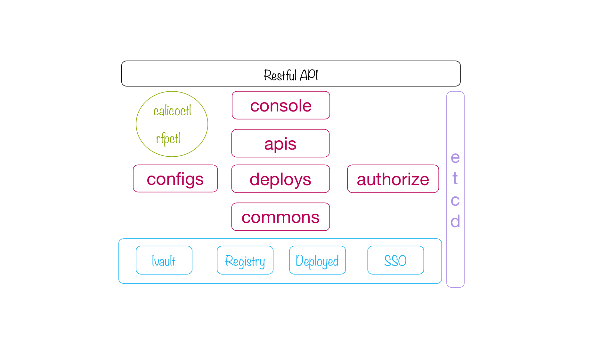

# LAIN Console

## 基本介绍
LAIN Console 组件属于 LAIN 集群的 layer1 组件，是 sa/op/dev/testing 使用 LAIN 的控制台。LAIN Console 使用 Django 搭建，主要提供的功能包括：

- LAIN App 管理（注册、部署、更新、扩容等）

- 权限管理，限制 user 对 app 的操作权限，同时也提供 lain registry 的 auth 服务

## 架构介绍

LAIN Console 仓库地址为： `https://github.com/laincloud/console.git`

LAIN Console 的架构图如下所示：

主要包括的模块为：

- console：对外提供 Restful API，主要包括 /repos/, /apps/, /maintainers/, /roles/, /authorize/ 等API；

- apis: 主要逻辑模块，lain 中提供的 app、service、resource 等部署方式由该模块进行组装，同时调用 authrize、deploys、configs 等相应模块完成操作；

- authorize：认证模块，封装了对 SSO 的操作接口，提供权限管理功能；

- deploys：部署模块，封装了 deployd 的操作接口，提供部署功能；

- configs：应用配置处理模块，封装了 console 构建 secret file 的操作接口，提供 config image 的管理功能；

- commons: 公共模块，封装了一些公有的环境变量，同时对 calico、registry、etcd 等的操作进行了封装； 

- external bin：包括 calicoctl 以及 rfpctl，calicoctl 用于提供 calico profile 设置，rfpctl 用于构建 config image；

LAIN Console 的 API 可以在[这里](docs/API.md)查看

## 工作流程

Console 组件属于 LAIN 中与其他组件结合非常紧密的一个组件，与其相关的组件包括 LAIN Registry, LAIN Deployd, LAIN SSO, LAIN lvault。Console 的部署文档可以参考 [LAIN whitepaper](https://laincloud.gitbooks.io/white-paper/content/developmanual/console/console-install.html)

Console 使用 etcd 作为存储后端，apps 的部署信息及版本信息全部存储在 `/lain/console/apps/` 目录下；

权限相关的信息则从 SSO 系统中进行获取；

配置相关的信息则从 lvault 中进行获取；

在用户使用 Console Api 部署应用时，主要经过的流程如下：

1. 根据 SSO 检查 User 对于 App 的权限（开启 auth 的情况下）；

1. 从 Registry 上下载 App 对应的 meta 镜像并进行 lain.yaml 的解析；

1. 从 lvault 上获取相应信息生成 config image，并进行相应 image 的组装（配置了 secret file 的情况下）

1. 调用 Deployd 进行部署

## Auth 设置

LAIN Console 组件中关于 auth 的使用可以参考 [LAIN whitepaper](https://laincloud.gitbooks.io/white-paper/content/adminmanual/auth.html)
